# Design Document

## 1. Data Model

The core model is intentionally small and close to the billing domain: a `business` owns many `customers`, and each `customer` owns many `invoices`. Each `invoice` has line items and a one-to-many `payment_attempts` collection.

### Tables

- `businesses`: `id`, `name`, `api_key_prefix`, `api_key_hash`, `revoked_at`, `created_at`
- `customers`: `id`, `business_id`, `name`, `email`, `created_at`
- `invoices`: `id`, `business_id`, `customer_id`, `currency`, `due_date`, `total_cents`, `state`, `created_at`, `updated_at`
- `invoice_line_items`: `id`, `invoice_id`, `description`, `quantity`, `unit_amount_cents`
- `payment_attempts`: `id`, `invoice_id`, `business_id`, `idempotency_key`, `token`, `status`, `amount_cents`, `error_code`, `psp_reference`, `retry_count`, `next_attempt_at`, `created_at`, `updated_at`
- `webhook_endpoints`: `id`, `business_id`, `url`, `secret`, `active`, `created_at`
- `webhook_events`: `id`, `business_id`, `event_type`, `payload_json`, `status`, `attempts`, `next_attempt_at`, `last_error`.
- `idempotency_keys`: `business_id`, `invoice_id`, `idempotency_key`, `request_hash`, `status`, `response_code`, `response_body`

### Primary key strategy

All tables use UUID primary keys. This keeps requests and events easy to correlate across services and avoids sequence contention in a distributed or sharded future setup. For the `idempotency_keys` table, the primary key is `(business_id, invoice_id, idempotency_key)` so the same idempotency key can only match one invoice invocation within a business.

### Indexes

- `customers(business_id)`
- `invoices(business_id, state)`
- `invoice_line_items(invoice_id)`
- `payment_attempts(invoice_id, created_at DESC)`
- `webhook_events(status, next_attempt_at)`

### Why this shape

The database matches the business problem closely. An invoice is immutable in most fields after creation; state and payment history are derived from separate records. This avoids storing duplicate payment state on the invoice row while still making the invoice query fast. The line-item table preserves the true invoice total without trusting client-sent totals.

### 100x scale changes

At 100x scale, I would add partitioning by `business_id` or `created_at`, keep a separate read model for invoice summaries, and move webhook processing to a dedicated worker pool or queue. I would also keep a denormalized `invoice_totals` table if the app becomes heavy on billing reports.

## 2. Invoice State Machine

```mermaid
stateDiagram-v2
    [*] --> draft
    draft --> open: invoice is issued
    draft --> void: cancelled before issue
    open --> paid: payment succeeds
    open --> void: business voids invoice
    open --> uncollectible: manual collection failure
    open --> open: payment attempt fails; invoice remains payable
    paid --> [*]
    void --> [*]
    uncollectible --> [*]
```



The main business state is `open`: the invoice is due and can be paid. `paid`, `void`, and `uncollectible` are terminal states. Invoice creation is `open` in the API for simplicity, while `draft` exists as a conceptual pre-issuance state in the design the service can support if the business decides to create invoices before formal issuance. An invoice cannot be voided while a payment attempt is pending or processing, avoiding a successful external charge against a locally void invoice.

Valid transitions are enforced server-side using a simple allowlist. Invalid transitions are rejected with `409 Conflict` and a structured error payload such as:

```json
{
  "error": {
    "code": "invalid_transition",
    "message": "cannot pay an invoice in void state"
  }
}
```

Transitions are intentionally conservative: there is no `paid -> open` reversal, and `void` or `paid` cannot be changed back. This keeps the ledger trustworthy and makes webhook events easy to reason about.

## 3. Payment Correctness & Failure Modes

### (a) Two clients call POST /invoices/{id}/pay at the same instant

Payment admission uses a **pessimistic row-level lock**: `BeginPayment` runs `SELECT ... FOR UPDATE` on the invoice row inside a transaction. Concurrent payment or void operations for that invoice wait for the row lock, then re-check the invoice state and active payment attempts. The first request inserts its payment attempt and idempotency record and commits; a waiting request then sees the active attempt and returns a conflict instead of starting a second charge. `VoidInvoice` uses the same invoice-row lock so it cannot race past payment admission.

`FinishPayment` also updates the invoice with `WHERE state = 'open'` and checks that exactly one row was changed. This is a conditional state-transition guard, but it is **not full optimistic locking**: the schema has no version/revision column, and callers do not read a version and retry after a conflict. PostgreSQL still takes a row-level write lock while applying the `UPDATE`.

Workers claim pending payment attempts and webhook events with `SELECT ... FOR UPDATE SKIP LOCKED`, which is also pessimistic row-level locking. It lets concurrent workers skip rows another worker has claimed rather than wait on them. Ordinary invoice reads do not explicitly lock rows.

### (b) The mock PSP times out (`tok_timeout`, 30s)

The service calls the PSP with a short HTTP client timeout, so the API does not block. If the PSP exceeds the client deadline, the payment attempt is marked `pending`, the invoice remains in `open`, and the endpoint returns `202 Accepted`. A worker reclaims pending attempts with increasing retry delays and retries the PSP request with the exact same idempotency key, amount, currency, and token; callers can poll `GET /invoices/{id}/payment` or receive a webhook when it resolves.

```json
{
  "invoice_id": "...",
  "payment_status": "pending",
  "message": "payment is processing; final result is delivered asynchronously"
}
```

This keeps the API responsive while allowing recovery instead of leaving the invoice permanently in a half-finished state.

### (c) The PSP returns success but the service crashes before persisting that

The service stores the idempotency key prior to the external call and derives a PSP key scoped to the business and invoice. It forwards that same key, amount, and currency on every retry. On recovery, the worker repeats the request with that key; an idempotent PSP returns the original result instead of charging again. Production integrations must use a PSP that durably enforces idempotency for the PSP's documented retention period.

### (d) An idempotency key is reused with a different request body

The API rejects it with `409 Conflict` and a clear error: `idempotency_key_conflict`. The key identifies a unique payment intent, not a generic reusable token. A request with the same key but different `card_token` is treated as an application error that must be fixed by the caller.

### (e) An invoice in paid state receives another POST /pay

The endpoint validates the state before the external payment call and rejects the transition with `409` because `open -> paid` is allowed but `paid -> paid` is not. The state machine is strict and prevents duplicate charges after the invoice is already marked as paid.

## 4. Webhook Design

### Signing scheme

Webhook payloads are signed with HMAC-SHA256 over the timestamp and body. The message is built as:

`timestamp + "." + payload`

The resulting hex digest is sent in `X-Dodo-Signature: sha256=<digest>`, alongside `X-Dodo-Event` and `X-Dodo-Timestamp`. This allows the receiver to independently verify the payload and reject tampering.

### Replay protection

We include a timestamp and require receivers to accept only a small tolerance window, e.g. 5 minutes. In a production system I would also include a unique event ID and persist seen IDs to reject duplicate delivery attempts.

### Retry policy

Webhook attempts retry with exponential backoff: 1 minute, 5 minutes, 30 minutes, 2 hours, then fail out after a fixed budget. The backing table stores the event, `attempts`, and `next_attempt_at`; the worker loop replays pending events without blocking the API responses. Events left in `processing` by a worker crash are returned to the pending queue after a five-minute lease.

When delivery exhausts the retry budget, the event is marked `failed` and the business is expected to reconcile missed events by replaying or querying the event log. This is a sensible operational model for a low-volume billing system.

### Why delivery is decoupled from the API response path

If webhook delivery were synchronous, a slow third-party endpoint would increase API latency and potentially force transaction rollback decisions in the middle of the invoice update path. Instead, the API writes the event to the queue and returns immediately. A background worker handles sending and retries. This keeps the customer-facing API fast and predictable.

## 5. API Key Model

API keys are random, high-entropy secrets. The hash is stored in `businesses.api_key_hash`, while the service keeps only a short prefix (`dev_business`) for identification. Transmission happens over HTTPS in production; the app accepts keys via `X-API-Key` and validates them on every request.

Key rotation is implemented by having a new key hash inserted and the old key marked revoked in the database. Revocation is handled through the `revoked_at` column. If a key leaks, the blast radius is limited to the business that owns the key; the service should rotate the key immediately and inspect logs for abuse.

## 6. What You Cut and Why

- I did not build recurring subscriptions or plans.
- I did not build refund logic or partial payments.
- I did not add multi-currency or FX handling.
- I did not implement a full frontend.
- I did not build a complex rate-limiting layer beyond a basic product-level design note.

These cut scopes are deliberate: they fall outside the core billing state machine and would add complexity without improving confidence in the required failure-handling semantics. The service supports USD, GBP, INR, and EUR as distinct invoice currencies, but does not convert between currencies or handle foreign exchange.

## 7. Production Readiness Gap

If this shipped tomorrow, the top three gaps would be:

1. Observability: the API emits structured request logs and lifecycle events for invoice creation/voiding, payment attempts and retries, and webhook delivery/retries. Records include trace IDs for API requests and relevant business, invoice, attempt, or event IDs; sensitive credentials, payment tokens, webhook secrets, endpoint URLs, and payloads are not logged. A metrics dashboard, alerting, and end-to-end traces are still needed for production operations.
2. Auditability: who changed what, when, and under which API key; this matters both for billing integrity and support workflows.
3. Operational controls: stronger rate limiting, alerting for retry storms, and a business-facing reconciliation dashboard for missed webhooks.

These are not built here because the assignment intentionally focuses on the billing state machine and failure modes rather than enterprise controls.

## Testing

I included the following targeted tests in the project:

- concurrent payment protection test
- idempotency replay test
- timeout/failure test ensuring the invoice remains in a stable state

The high-value cases are chosen to validate the assignment’s most error-prone paths without over-testing low-risk routes.
